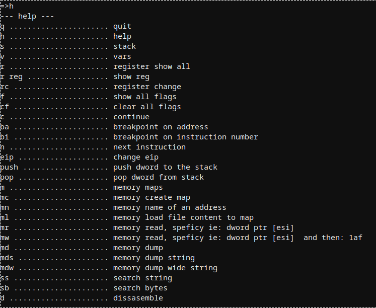
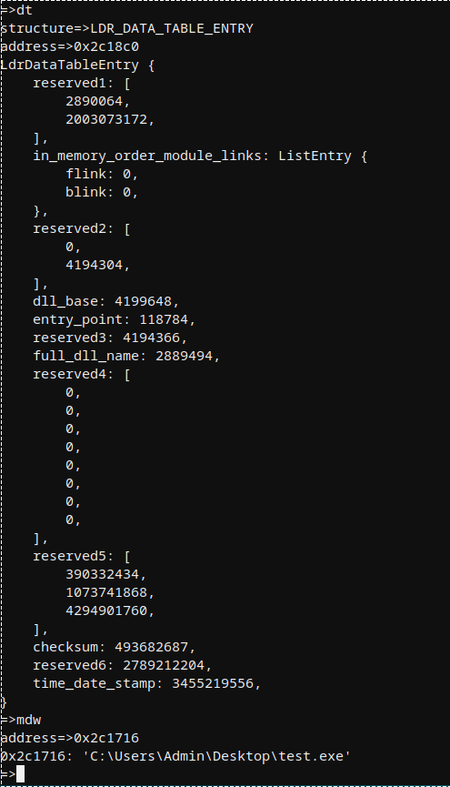

# scemu
x86 32bits emulator, for securely emulating shellcodes 

## Features
- 📦 rust safety, good for malware. 
	- All dependencies are in rust.
	- zero unsafe{} blocks.
- ⚡ very fast emulation (much faster than unicorn) 
	- 3,000,000 instructions/second
	- 100,000 instructions/second printing every instruction -vv.
- powered by iced-x86 rust dissasembler awesome library.
- iteration detector.
- memory and register tracking.
- colorized.
- stop at specific moment and explore the state or modify it.
- 105 instructions implemented.
- 112 winapi implemented of 5 dlls.
- all linux syscalls.
- SEH chains.
- vectored exception handler.
- PEB, TEB structures.
- memory allocator.
- react with int3.
- non debugged cpuid.
- tests with known payloads:
	- metasploit shellcodes.
	- metasploit encoders.
	- cobalt strike.
	- shellgen.
	- guloader (not totally for now, but arrive further than the debugger)

## TODO
	- more fpu
	- mmx
	- 64 bits
	- scripting?

## Usage
```
SCEMU 32bits emulator for Shellcodes 0.2.5
@sha0coder

USAGE:
    scemu [FLAGS] [OPTIONS]

FLAGS:
    -e, --endpoint    perform communications with the endpoint, use tor or vpn!
    -h, --help        Prints help information
    -l, --loops       show loop interations, it is slow.
    -m, --memory      trace all the memory accesses read and write.
    -n, --nocolors    print without colors for redirectin to a file >out
    -r, --regs        print the register values in every step.
    -V, --version     Prints version information
    -v, --verbose     -vv for view the assembly, -v only messages, without verbose only see the api calls and goes
                      faster

OPTIONS:
    -b, --base <ADDRESS>            set base address for code
    -c, --console <NUMBER>          select in which moment will spawn the console to inspect.
    -C, --console_addr <ADDRESS>    spawn console on first eip = address
    -e, --entry <ADDRESS>           entry point of the shellcode, by default starts from the beginning.
    -f, --filename <FILE>           set the shellcode binary file.
    -i, --inspect <DIRECTION>       monitor memory like: -i 'dword ptr [ebp + 0x24]
    -M, --maps <PATH>               select the memory maps folder
    -R, --reg <REGISTER>            trace a specific register in every step, value and content
    -s, --string <ADDRESS>          monitor string on a specific address
```

## Some use cases

scemu emulates a simple shellcode detecting the execve() interrupt.


We select the line to stop and inspect the memory.


After emulating near 2 million instructions of GuLoader win32 in linux, faking cpuid's and other tricks in the way, arrives to a sigtrap to confuse debuggers. 


Example of memory dump on the api loader.


There are several maps by default, and can be created more with apis like LoadLibraryA or manually from the console.


Emulating basic windows shellcode based on LdrLoadDLl() that prints a message:


The console allow to view an edit the current state of the cpu:


The cobalt strike api loader is the same that metasploit, emulating it:


Cobalt Strike API called:


Metasploit rshell API called:


Metasploit SGN encoder using few fpu to hide the polymorfism:


Metasploit shikata-ga-nai encoder that also starts with fpu:


Displaying PEB structure:


Displaying PEB_LDR_DATA structure:


Displaying LDR_DATA_TABLE_ENTRY and first module name



